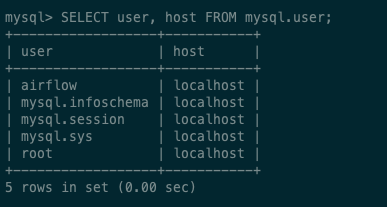

# Setup (In Progress)

## Install Python 3.x with ```Miniconda```

Go [here](https://docs.conda.io/en/latest/miniconda.html##:~:text=Miniconda%20is%20a%20free%20minimal,zlib%20and%20a%20few%20others.) to install Miniconda.

Use the code below to confirm the ```checksum``` of the file.

```bash
echo -n "foobar" | openssl dgst -sha256
```

<br/>


## Install ```mysqlclient```

Run the code below to install ```mysqlclient```.

```bash
conda install mysqlclient
```


## Install MySQL

Install MySQL with Homebrew. Check [this](https://gist.github.com/nrollr/3f57fc15ded7dddddcc4e82fe137b58e) gist to learn the installation process.


<br/>


# Creating your first data pipeline in Python

Access your local MySQL instance using the following command

```bash
mysql -u root -p
```

Create a new database called ```airflowdb``` using the following code.

```sql
CREATE DATABASE airflowdb CHARACTER SET utf8 COLLATE utf8_unicode_ci;
```

Create a new user for the database.

```sql
CREATE USER 'airflow'@'localhost' IDENTIFIED BY 'thisIsAwesome@20'
```

Now we need to make sure the airflow user has access to the databases.

```sql
GRANT ALL PRIVILEGES ON *.* TO 'airflow'@'localhost';
FLUSH PRIVILEGES
```

Check the list of users to make sure the user was successfully added.

```mysql
SELECT user, host FROM mysql.user;
```




If you need to delete the user you just added, use the code below
```sql
DROP USER 'airflow'@'localhost'
```

## Issues
Turns out you don't need the tweepy package to use Twitter's API. They recently released ```Twitter API v2``` which exposes several endpoints that can be used to manage tweets, get them, etc. You can find the documentation [here](https://developer.twitter.com/en/docs/twitter-api/data-dictionary/introduction).


